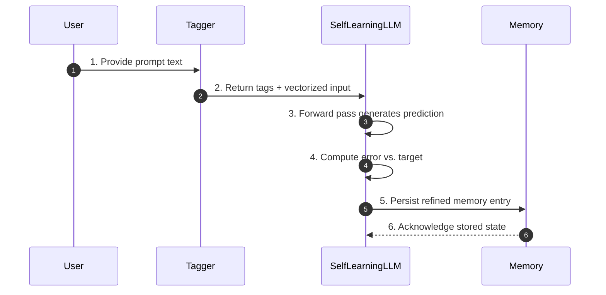

# 🧠 Self-Learning LLM in JavaScript Mock-Up  
### |Ψ_Documentation.Version⟩ = 0.1.1  
### |Ψ_Principle⟩ = "Bridge imagination with functional structure."

---

## 📦 Overview

This project is a lightweight, logic-driven, self-learning language model built entirely in JavaScript. It mimics neural behavior using symbolic vectorization, local memory, and basic feedforward logic to learn and respond to text prompts over time.

---

## 🧠 Core Concept

- **Tag + Intention Mapping**: Each word or phrase is tagged with semantic meaning and inferred intent.
  - Example:  
    `User: "How are you?"` → `Tags: ["how", "are you", "question"]`
- **Learning Behavior**:  
  - Initially mimics prompts using basic echo logic.  
  - Over time, forms contextual replies through memory reinforcement and vector adjustments.

---

## 🔧 Architecture

### Core Components

| Component        | Description                                                                 |
|------------------|-----------------------------------------------------------------------------|
| `Neuron`         | Basic unit with weights, bias, and sigmoid activation.                      |
| `Layer`          | Collection of neurons forming a feedforward layer.                          |
| `SelfLearningLLM`| Main model class with input, hidden, and output layers.                     |
| `Memory`         | In-memory or persistent memory store for learned prompts/responses.         |
| `LocalMemory`    | Uses `localStorage` for persistent memory across sessions.                  |
| `Tagger`         | Extracts semantic tags and intentions from user input.                      |

### 🧭 System Architecture Spec

```ts
interface Neuron {
  weights: number[];
  bias: number;
  activate(inputs: number[]): number;
  adjust(params: { inputs: number[]; error: number; learningRate?: number }): void;
}

// Parameter contracts
// - activate: expects inputs.length === weights.length and values normalized between 0 and 1.
// - adjust.learningRate defaults to 0.1 when omitted.

interface Layer {
  neurons: Neuron[];
  forward(inputs: number[]): number[];
  train(params: { inputs: number[]; errors: number[]; learningRate: number }): void;
}

// - forward: propagates inputs sequentially through all neurons.
// - train: errors must align with neurons.length; learningRate > 0.

interface Tagger {
  extractTags(payload: { text: string; locale?: string }): string[];
}

// - text: raw user prompt; locale defaults to "en".

interface Memory<TValue = unknown> {
  remember(entry: { key: string; value: TValue; tags?: string[] }): void;
  recall(query: { key: string }): TValue | undefined;
  forget(target: { key: string }): void;
}

interface LocalMemory<TValue = unknown> extends Memory<TValue> {
  namespace: string;
  listKeys(): string[];
}

// - namespace: storage isolation identifier; immutable post-construction.
// - remember: serializes value via JSON.stringify before persistence.

interface SelfLearningLLM {
  readonly inputSize: number;
  readonly hiddenSize: number;
  readonly outputSize: number;
  predict(input: { vector: number[] }): number[];
  train(params: {
    vector: number[];
    target: number[];
    learningRate?: number;
  }): { errorVector: number[] };
  learnFrom(example: { prompt: string; response: string }): void;
  vectorize(payload: { text: string }): number[];
  tag(payload: { text: string }): string[];
}

// - predict: vector length must equal inputSize.
// - train: target length must equal outputSize; learningRate defaults to 0.1.
// - learnFrom: stores prompt/response pairs in Memory and triggers train().
```

---

## 🧠 Learning Flow



### Stage Preconditions & Postconditions

1. **Input Tagging**
   - *Pre*: Raw prompt string provided; Tagger configured with locale lexicon.
   - *Post*: Tags array and normalized vector ready for the model.
2. **Forward Pass**
   - *Pre*: Input vector length equals `inputSize`; weights and biases initialized.
   - *Post*: Output activations produced for interpretation.
3. **Error Calculation**
   - *Pre*: Expected target vector resolved from memory or supervision signal.
   - *Post*: Error vector computed and propagated to weight adjustment logic.
4. **Memory Update**
   - *Pre*: Latest prompt, response, tags, and error context available.
   - *Post*: Memory store contains new or updated entry, ready for future retrieval.

---

## 🗃️ Data Schemas

### Prompt Payload

```ts
type Prompt = {
  id: string; // UUID v4
  text: string; // Raw user message
  timestamp: string; // ISO-8601
  locale?: string; // Optional BCP-47 locale
};

const examplePrompt: Prompt = {
  id: "8cc3c1a0-79ad-4a70-8676-1c79c0e2c7f0",
  text: "How are you?",
  timestamp: "2024-05-01T12:04:33.000Z",
  locale: "en-US",
};
```

### Tag Collection

```ts
type Tag = {
  token: string; // Normalized keyword or phrase
  confidence: number; // 0 to 1
  intent?: string; // Optional inferred intent label
};

type TagList = Tag[];

const exampleTags: TagList = [
  { token: "how", confidence: 0.92, intent: "question" },
  { token: "are you", confidence: 0.87 },
  { token: "question", confidence: 0.78, intent: "topic:status" },
];
```

### Vector Representation

```ts
type Vector = {
  dimensions: number; // e.g., 32
  values: number[]; // Length equals dimensions, normalized 0-1
  encoding: "bag-of-words" | "embedding";
};

const exampleVector: Vector = {
  dimensions: 32,
  values: Array(32).fill(0).map((v, idx) => (idx === 1 ? 0.78 : v)),
  encoding: "bag-of-words",
};
```

### Memory Entry

```ts
type MemoryEntry = {
  key: string; // Hash of prompt text
  prompt: Prompt;
  response: string; // Model or user-provided answer
  vector: Vector;
  tags: TagList;
  errorVector?: number[]; // Optional for training diagnostics
  updatedAt: string; // ISO-8601
};

const exampleMemoryEntry: MemoryEntry = {
  key: "prompt:how-are-you",
  prompt: examplePrompt,
  response: "I'm continually learning!",
  vector: exampleVector,
  tags: exampleTags,
  errorVector: [0.12, -0.03, 0.04],
  updatedAt: "2024-05-01T12:05:10.000Z",
};
```

---

## 💾 Persistence Strategy

- **Local Phase (`LocalMemory`)**: Data persists via `localStorage` under a namespace per model instance. Entries are JSON-serialized memory payloads keyed by prompt hashes.
- **Transition Trigger**: When entry count or payload size exceeds configurable thresholds (e.g., 1,000 entries or 5 MB), initiate migration to a structured IndexedDB store.
- **IndexedDB Layout**: Utilize object stores for `prompts`, `vectors`, and `metadata`, keyed by prompt hash with indexed timestamps to support range queries.
- **Migration Flow**:
  1. Snapshot existing `LocalMemory` keys and values.
  2. Initialize IndexedDB schema with version bump and migration script.
  3. Replay snapshot into IndexedDB, ensuring idempotent writes and conflict resolution.
  4. Replace `LocalMemory` read/write adapters with IndexedDB-backed implementations.
  5. Purge migrated `localStorage` entries once parity verification passes.
- **Future Scalability**: Abstract persistence interface to support remote stores (e.g., REST, SQLite WASM) while keeping schema contracts identical.

---

## 🧩 Modules

### `Neuron.js`

```js
class Neuron {
  constructor(weights = [], bias = 0) { ... }
  activate(inputs) { ... }
  adjust(inputs, error, learningRate = 0.1) { ... }
}
```

### `Layer.js`

```js
class Layer {
  constructor(size, inputSize) { ... }
  forward(inputs) { ... }
  train(inputs, errors, learningRate) { ... }
}
```

### `Memory.js`

```js
class Memory {
  remember(key, value) { ... }
  recall(key) { ... }
  forget(key) { ... }
}
```

### `LocalMemory.js`

```js
class LocalMemory {
  constructor(namespace = "LLM_Memory") { ... }
  remember(key, value) { ... }
  recall(key) { ... }
  forget(key) { ... }
  listKeys() { ... }
}
```

### `Tagger.js`

```js
class Tagger {
  extractTags(text) {
    // Basic keyword + intent mapping
    return [...];
  }
}
```

### `SelfLearningLLM.js`

```js
class SelfLearningLLM {
  constructor(inputSize, hiddenSize, outputSize) { ... }
  predict(input) { ... }
  train(input, target, learningRate = 0.1) { ... }
  learnFrom(prompt, response) { ... }
  vectorize(text) { ... }
  tag(text) { return new Tagger().extractTags(text); }
}
```

---

## 🧪 Example Usage

```js
const llm = new SelfLearningLLM(32, 16, 32);
llm.learnFrom("hello", "hi there");
console.log(llm.predict(llm.vectorize("hello")));
console.log(llm.tag("How are you?")); // → ["how", "are you", "question"]
```

---

## 🌱 Advanced Learning Seeds

Users can inject custom seeds to guide the model’s behavior:

```js
llm.learnFrom("What's your name?", "I'm a JavaScript LLM!");
```

These seeds act as behavioral anchors for specific prompts.

---

## 🧠 Future Extensions

- 🧬 Tokenizer + Grammar Parser
- 🧠 Reinforcement Learning (reward-based feedback)
- 🧭 Memory Pruning (entropy-based)
- 🧠 IndexedDB for scalable memory
- 📊 Dashboard for memory visualization
- 🧠 Tag-based response routing

---

## 🛡️ Ethical Protocols

- All learning is **local** and **user-controlled**.
- Memory is **transparent**: inspect, modify, or delete anytime.
- No external data is fetched or stored without **explicit user intent**.

---
