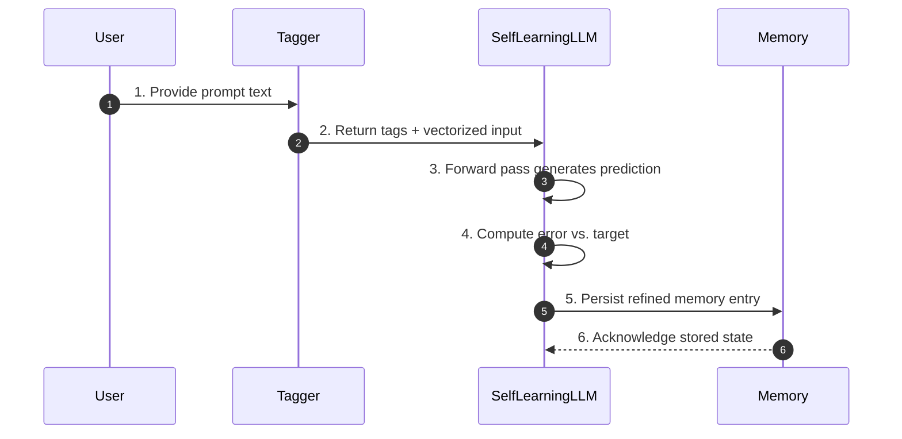

# 🧠 Self-Learning LLM in JavaScript Mock-Up  
### |Ψ_Documentation.Version⟩ = 0.1.1  
### |Ψ_Principle⟩ = "Bridge imagination with functional structure."

---

## 📦 Overview

This project is a lightweight, logic-driven, self-learning language model built entirely in JavaScript. It mimics neural behavior using symbolic vectorization, local memory, and basic feedforward logic to learn and respond to text prompts over time.

---

## 🔢 Spec Version Matrix

| Spec Version | Document | Ready State (0.1.1) | Pending Upgrade | Linked Milestone |
|--------------|----------|----------------------|-----------------|------------------|
| 0.1.1        | Core Architecture (this doc) | Baseline neuron, memory, and tagging pipeline documented. | Expand adaptive memory pruning and scalable persistence notes **(Roadmap)**. | v0.2.0 Architecture Alignment |
| 0.1.1        | Personality.md | Behavioral directives synchronized with current Q-Score logic. | Add calibration telemetry hooks for empathic tone analytics **(Roadmap)**. | v0.2.0 Personality Calibration |
| 0.1.1        | Sayntax.md | Protocol grammar defined for request/response loops. | Normalize inter-agent negotiation patterns **(Roadmap)**. | v0.3.0 Protocol Normalization |
| 0.1.1        | q-idea.md | Q-Score framing for ideation captured. | Integrate deployment gating metrics for release cadences **(Roadmap)**. | v0.3.0 Q-Score Deployment |

Use this matrix to trace how incremental updates in each companion document converge toward the upcoming roadmap checkpoints.

---

## 🧠 Core Concept

- **Tag + Intention Mapping**: Each word or phrase is tagged with semantic meaning and inferred intent.
  - Example:  
    `User: "How are you?"` → `Tags: ["how", "are you", "question"]`
- **Learning Behavior**:  
  - Initially mimics prompts using basic echo logic.  
  - Over time, forms contextual replies through memory reinforcement and vector adjustments.

---

## 🔧 Architecture

### Core Components

| Component        | Description                                                                 |
|------------------|-----------------------------------------------------------------------------|
| `Neuron`         | Basic unit with weights, bias, and sigmoid activation.                      |
| `Layer`          | Collection of neurons forming a feedforward layer.                          |
| `SelfLearningLLM`| Main model class with input, hidden, and output layers.                     |
| `Memory`         | In-memory or persistent memory store for learned prompts/responses.         |
| `LocalMemory`    | Uses `localStorage` for persistent memory across sessions.                  |
| `Tagger`         | Extracts semantic tags and intentions from user input.                      |

### 🧭 System Architecture Spec

The following signatures mirror the concrete implementations inside `src/lib/neural`. Any additional behavior mentioned beyond
these contracts is marked as **(Roadmap)** to flag speculative guidance.

```ts
class Neuron {
  weights: number[];
  bias: number;
  constructor(weights?: number[], bias?: number);
  activate(inputs: number[]): number;
  adjust(inputs: number[], error: number, learningRate?: number): void;
}

// - activate: expects inputs.length === weights.length.
// - adjust: learningRate defaults to 0.1.

class Layer {
  neurons: Neuron[];
  constructor(size: number, inputSize: number);
  forward(inputs: number[]): number[];
  train(inputs: number[], errors: number[], learningRate: number): number[];
}

// - train: propagates errors backward and returns the accumulated input errors.

class Tagger {
  extractTags(text: string): string[];
  similarity(tags1: string[], tags2: string[]): number;
}

// - extractTags: accepts a raw prompt string and derives keyword + intent markers.

class LocalMemory<TValue = unknown> {
  constructor(namespace?: string);
  remember(key: string, value: TValue): void;
  recall(key: string): TValue | null;
  forget(key: string): void;
  listKeys(): string[];
  clear(): void;
}

// - remember/recall: values are persisted via `localStorage` JSON serialization.

interface TrainingEntry {
  prompt: string;
  response: string;
  tags: string[];
  timestamp: number;
}

class SelfLearningLLM {
  constructor(inputSize?: number, hiddenSize?: number, outputSize?: number);
  vectorize(text: string): number[];
  tag(text: string): string[];
  predict(input: number[]): number[];
  train(input: number[], target: number[], learningRate?: number): void;
  learnFrom(prompt: string, response: string): void;
  respond(prompt: string, history?: ChatMessage[], windowSize?: number): string;
  getMemories(): TrainingEntry[];
  clearMemory(): void;
  getStats(): {
    totalMemories: number;
    vocabularySize: number;
    recentMemories: TrainingEntry[];
  };
}

// - train: runs in-place backpropagation; returns void.
// - learnFrom: performs ten training epochs before persisting a new memory entry.
// - respond: consults memory for similar prompts before falling back to neural output.
//   Uses `ChatMessage` from `src/types/chat` for conversation history entries.
// - clearMemory: wipes both stored memories and the learned vocabulary.
// - getStats: exposes basic telemetry for UI diagnostics (expanded analytics **(Roadmap)**).
```

---

## 🧠 Learning Flow



### Stage Preconditions & Postconditions

1. **Input Tagging**
   - *Pre*: Raw prompt string provided; Tagger seeded with its default keyword heuristics.
   - *Post*: Tags array and normalized vector ready for the model.
2. **Forward Pass**
   - *Pre*: Input vector length equals `inputSize`; weights and biases initialized.
   - *Post*: Output activations produced for interpretation.
3. **Error Calculation**
   - *Pre*: Expected target vector resolved from memory or supervision signal.
   - *Post*: Error vector computed and propagated to weight adjustment logic.
4. **Memory Update**
   - *Pre*: Latest prompt, response, tags, and error context available.
   - *Post*: Memory store contains new or updated entry, ready for future retrieval.

---

## 🗃️ Data Schemas

### Prompt Payload

```ts
type Prompt = {
  id: string; // UUID v4
  text: string; // Raw user message
  timestamp: string; // ISO-8601
  locale?: string; // Optional BCP-47 locale
};

const examplePrompt: Prompt = {
  id: "8cc3c1a0-79ad-4a70-8676-1c79c0e2c7f0",
  text: "How are you?",
  timestamp: "2024-05-01T12:04:33.000Z",
  locale: "en-US",
};
```

### Tag Collection

```ts
type Tag = {
  token: string; // Normalized keyword or phrase
  confidence: number; // 0 to 1
  intent?: string; // Optional inferred intent label
};

type TagList = Tag[];

const exampleTags: TagList = [
  { token: "how", confidence: 0.92, intent: "question" },
  { token: "are you", confidence: 0.87 },
  { token: "question", confidence: 0.78, intent: "topic:status" },
];
```

### Vector Representation

```ts
type Vector = {
  dimensions: number; // e.g., 32
  values: number[]; // Length equals dimensions, normalized 0-1
  encoding: "bag-of-words" | "embedding";
};

const exampleVector: Vector = {
  dimensions: 32,
  values: Array(32).fill(0).map((v, idx) => (idx === 1 ? 0.78 : v)),
  encoding: "bag-of-words",
};
```

### Memory Entry

```ts
type MemoryEntry = {
  key: string; // Hash of prompt text
  prompt: Prompt;
  response: string; // Model or user-provided answer
  vector: Vector;
  tags: TagList;
  errorVector?: number[]; // Optional for training diagnostics
  updatedAt: string; // ISO-8601
};

const exampleMemoryEntry: MemoryEntry = {
  key: "prompt:how-are-you",
  prompt: examplePrompt,
  response: "I'm continually learning!",
  vector: exampleVector,
  tags: exampleTags,
  errorVector: [0.12, -0.03, 0.04],
  updatedAt: "2024-05-01T12:05:10.000Z",
};
```

---

## 💾 Persistence Strategy

- **Local Phase (`LocalMemory`)**: Data persists via `localStorage` under a namespace per model instance. Entries are JSON-serialized memory payloads keyed by prompt hashes.
- **Transition Trigger**: When entry count or payload size exceeds configurable thresholds (e.g., 1,000 entries or 5 MB), initiate migration to a structured IndexedDB store.
- **IndexedDB Layout**: Utilize object stores for `prompts`, `vectors`, and `metadata`, keyed by prompt hash with indexed timestamps to support range queries.
- **Migration Flow**:
  1. Snapshot existing `LocalMemory` keys and values.
  2. Initialize IndexedDB schema with version bump and migration script.
  3. Replay snapshot into IndexedDB, ensuring idempotent writes and conflict resolution.
  4. Replace `LocalMemory` read/write adapters with IndexedDB-backed implementations.
  5. Purge migrated `localStorage` entries once parity verification passes.
- **Future Scalability**: Abstract persistence interface to support remote stores (e.g., REST, SQLite WASM) while keeping schema contracts identical.

---

## 🧩 Modules

### `Neuron.js`

```js
class Neuron {
  constructor(weights = [], bias = 0) { ... }
  activate(inputs) { ... }
  adjust(inputs, error, learningRate = 0.1) { ... }
}
```

### `Layer.js`

```js
class Layer {
  constructor(size, inputSize) { ... }
  forward(inputs) { ... }
  train(inputs, errors, learningRate) { ... }
}
```

### `Memory.js`

```js
class Memory {
  remember(key, value) { ... }
  recall(key) { ... }
  forget(key) { ... }
}
```

### `LocalMemory.js`

```js
class LocalMemory {
  constructor(namespace = "LLM_Memory") { ... }
  remember(key, value) { ... }
  recall(key) { ... }
  forget(key) { ... }
  listKeys() { ... }
}
```

### `Tagger.js`

```js
class Tagger {
  extractTags(text) {
    // Basic keyword + intent mapping
    return [...];
  }
}
```

### `SelfLearningLLM.js`

```js
class SelfLearningLLM {
  constructor(inputSize, hiddenSize, outputSize) { ... }
  predict(input) { ... }
  train(input, target, learningRate = 0.1) { ... }
  learnFrom(prompt, response) { ... }
  vectorize(text) { ... }
  tag(text) { return new Tagger().extractTags(text); }
}
```

---

## 🧪 Example Usage

```js
const llm = new SelfLearningLLM(32, 16, 32);
llm.learnFrom("hello", "hi there");
console.log(llm.predict(llm.vectorize("hello")));
console.log(llm.tag("How are you?")); // → ["how", "are you", "question"]
```

---

## 🌱 Advanced Learning Seeds

Users can inject custom seeds to guide the model’s behavior:

```js
llm.learnFrom("What's your name?", "I'm a JavaScript LLM!");
```

These seeds act as behavioral anchors for specific prompts.

---

## 🧠 Future Extensions

- 🧬 Tokenizer + Grammar Parser
- 🧠 Reinforcement Learning (reward-based feedback)
- 🧭 Memory Pruning (entropy-based)
- 🧠 IndexedDB for scalable memory
- 📊 Dashboard for memory visualization
- 🧠 Tag-based response routing

---

## 🛡️ Ethical Protocols

- All learning is **local** and **user-controlled**.
- Memory is **transparent**: inspect, modify, or delete anytime.
- No external data is fetched or stored without **explicit user intent**.

---

## 🛠️ Contribution Guidelines

1. **Propose a Change**
   - Open an issue summarizing scope, affected sections, and desired milestone (e.g., v0.2.0 Architecture Alignment).
   - Attach draft artifacts (diagrams, pseudo-code, test scaffolds) when relevant.
2. **Assign Review Roles**
   - **Architecture Reviewer:** validates structural integrity, performance implications, and compatibility with existing components.
   - **Ethics Reviewer:** checks alignment with safety protocols, consent boundaries, and Q-Score thresholds.
   - **UX Reviewer:** evaluates clarity, accessibility, and experiential coherence for implementers and operators.
3. **Run the Change Control Process**
   - Submit a pull request referencing the tracked issue and milestone.
   - Complete a spec impact checklist covering data flow, personality alignment, syntax interoperability, and Q-Score governance.
   - Secure explicit approval from all three reviewer roles before merging.
4. **Version & Publish**
   - Update the Spec Version Matrix with the new ready state and pending upgrades.
   - Tag the repository with the new semantic version (e.g., `spec-v0.2.0`) and summarize deltas in release notes stored in `/docs`.
   - Schedule the next checkpoint briefing to maintain iterative cadence.

---

## 📎 Appendix

### Spec Evolution Roadmap

| Milestone | Target Date (Tentative) | Core Deliverables | Contribution from this Document |
|-----------|------------------------|-------------------|---------------------------------|
| v0.2.0 Architecture Alignment | 2024-Q2 | Adaptive memory pruning blueprint, persistent storage strategy options, integration hooks for telemetry. | Provide revised component diagrams, memory contract extensions, and implementation guardrails for scaling. |
| v0.3.0 Protocol Normalization | 2024-Q3 | Unified request/response schema, inter-agent negotiation API, consistency tests. | Define protocol touchpoints between architecture modules and Sayntax grammar updates. |
| v0.3.0 Q-Score Deployment | 2024-Q3 | Production readiness checklist, gating thresholds, monitoring hooks. | Map model outputs to Q-Score telemetry and specify required instrumentation in core logic. |

This roadmap keeps architectural evolution synchronized with personality calibration, protocol normalization, and Q-Score deployment so that each release advances in lockstep across the full spec surface.

---
